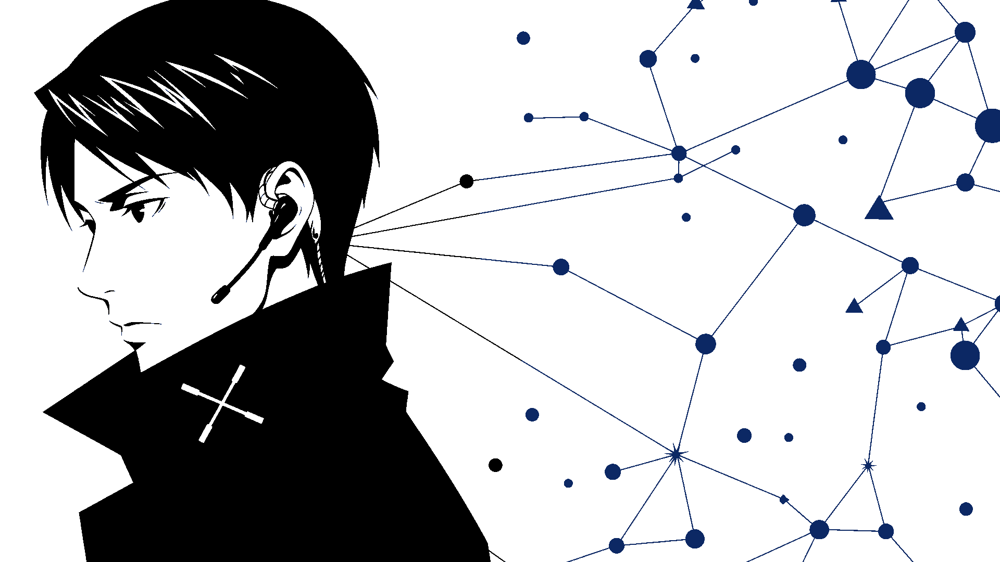
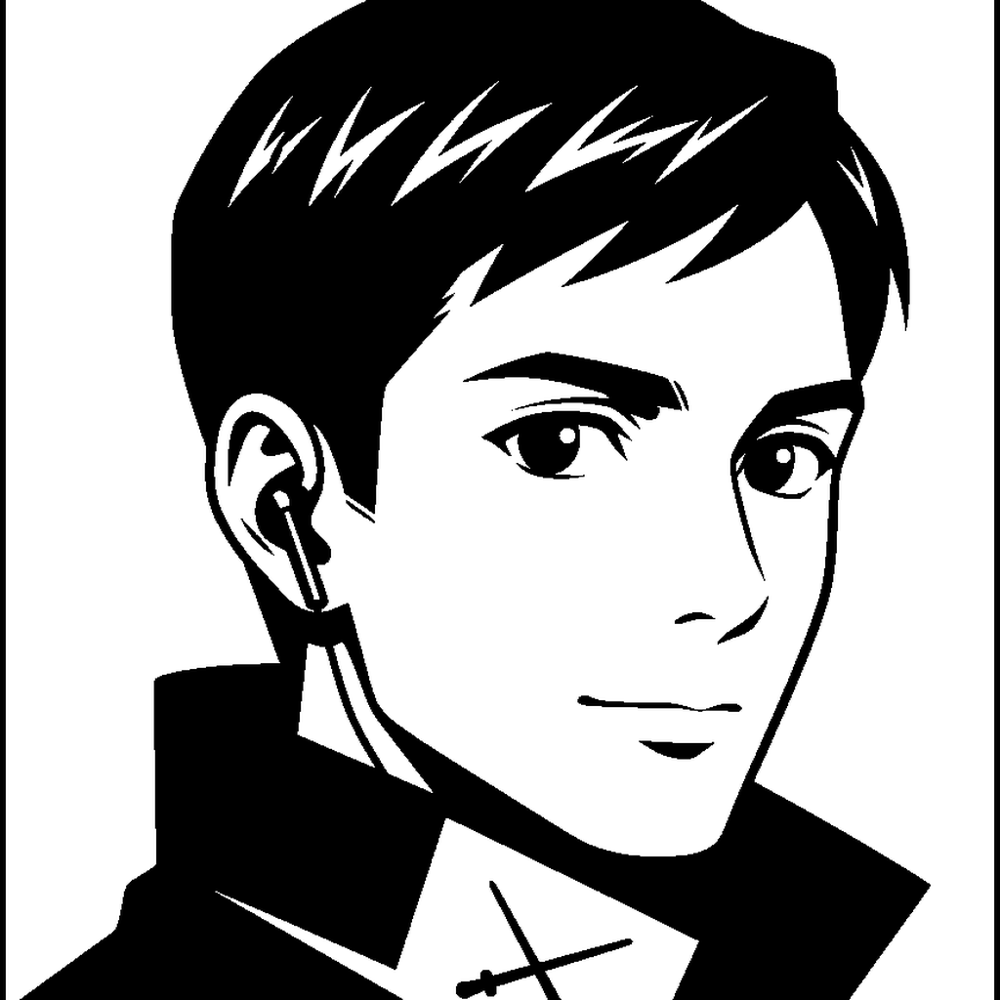

<div align="center">

# The Conductor



### Enhances the agent that uses it.

Skills · tools · tracks · **Remnants** · safety spine  
Amplify the meister — never replace them.

<br/>

[](https://github.com/PabloTheThinker/the-conductor-hermes)
[](CHANGELOG.md)
[](pyproject.toml)
[](LICENSE)
[](pyproject.toml)

<br/>

| [About](#about) | [Paths](#choose-your-path) | [Install](#quick-start) | [Packages](#packages--stack) | [Concepts](#core-concepts) | [Docs](#documentation) | [Mascot](#character) |
|:---:|:---:|:---:|:---:|:---:|:---:|:---:|

</div>

---

## Why Conductor

<table>
<tr>
<td width="33%" valign="top" align="center">

### 🎛️ Module, not a chat app

Load into **Hermes**, OpenClaw, or any host.  
You keep identity, tools, and soul.

</td>
<td width="33%" valign="top" align="center">

### 🔌 One surface, many clients

**MCP stdio** for Claude, Codex, Cursor, Grok —  
same tools, no host fork.

</td>
<td width="33%" valign="top" align="center">

### 🧭 Orchestration with spine

Pillars · combos A–H · Remnants · hooks.  
Direction without replacing native tools.

</td>
</tr>
</table>

---

## About

**The Conductor** is an open **skillset module** and **MCP server** for AI agent harnesses. It resonates with **[Hermes Agent](https://hermes-agent.nousresearch.com/)** as the primary host, and exposes the same capability surface over **stdio MCP** so external meisters can call it without becoming a second product.

| ❌ Not this | ✅ What it is |
|:------------|:--------------|
| A second chat product | A **module** your agent loads |
| A Hermes fork | Optional Hermes **plugin** + portable harness API |
| A host-identity replacement | Partner SOUL that **enhances** the meister |
| “ILO” or a persona kit | Orchestration, pillars, Remnants, safety spine |

**Who it’s for**

| Audience | Fit |
|----------|-----|
| **Hermes operators** | First-class plugin + skills under `HERMES_HOME` |
| **MCP teams** | Claude / Codex / Cursor / Grok on a shared orchestration stack |
| **Harness builders** | Embed `conductor.harness` in a custom agent loop |

<div align="center">

**Built by** [Pablo Navarro](https://github.com/PabloTheThinker) · **Vektra Industries** · MIT  
[github.com/PabloTheThinker/the-conductor-hermes](https://github.com/PabloTheThinker/the-conductor-hermes)

</div>

---

## Choose your path

Pick the integration that matches your host — **do not dual-load plugin + MCP in one process**.

<table>
<tr>
<td width="33%" valign="top">

#### 🟣 Hermes host
**Plugin only**

```bash
./scripts/install_for_hermes.sh
conductor hermes-ready
```

Guide → [docs/HERMES.md](docs/HERMES.md)

</td>
<td width="33%" valign="top">

#### 🔵 External meisters
**MCP stdio only**

```bash
pip install -e ".[mcp]"
conductor mcp
```

Guide → [docs/MCP.md](docs/MCP.md)

</td>
<td width="33%" valign="top">

#### ⚪ Custom loop
**Module API**

```python
from conductor.harness import (
  install, tool_schemas, execute_tool
)
```

Guide → [docs/MODULE_FOR_AGENTS.md](docs/MODULE_FOR_AGENTS.md)

</td>
</tr>
</table>

> **Dual-load rule** — Hermes gateway / TUI = **plugin only**. External meisters = **MCP only**. One process, one path.

---

## Quick start

```bash
git clone https://github.com/PabloTheThinker/the-conductor-hermes.git
cd the-conductor-hermes
python3 -m venv .venv && source .venv/bin/activate
pip install -e ".[dev]"

export CONDUCTOR_HOME="${CONDUCTOR_HOME:-$HOME/.conductor}"
conductor module install --harness generic
conductor module info
CONDUCTOR_PROVIDER=test conductor chat -q 'Reply with exactly: CONDUCTOR_OK'
```

<details>
<summary><strong>▸ Integrate in Python</strong></summary>

<br/>

```python
from conductor.harness import install, get_system_prompt, tool_schemas, execute_tool, hooks

install(harness="generic")  # or harness="hermes"
system = get_system_prompt(host_soul="~/.openclaw/SOUL.md")  # or auto-discover
tools = tool_schemas()
# in your loop: execute_tool(name, args, session_id=...)
# optional spine: hooks().pre_tool_call(...)
```

</details>

<details>
<summary><strong>▸ MCP (Claude / Codex / Cursor / Grok)</strong></summary>

<br/>

Full guide: **[docs/MCP.md](docs/MCP.md)**

```bash
pip install -e ".[mcp]"
conductor mcp          # stdio MCP server
conductor mcp tools    # list tools
```

</details>

<details>
<summary><strong>▸ Hermes as host (plugin)</strong></summary>

<br/>

Full guide: **[docs/HERMES.md](docs/HERMES.md)**

```bash
./scripts/install_for_hermes.sh

export HERMES_HOME="${HERMES_HOME:-$HOME/.hermes}"
export CONDUCTOR_HOME="$HERMES_HOME"
source "$HERMES_HOME/conductor.env"
conductor hermes-ready
hermes plugins list             # should include conductor
```

Manual:

```bash
export HERMES_HOME="${HERMES_HOME:-$HOME/.hermes}"
export CONDUCTOR_HOME="$HERMES_HOME"
pip install -e ".[dev]"
conductor setup --harness hermes --install-pip
```

Conductor **never** overwrites Hermes `SOUL.md` or native tools (`delegate_task`, `terminal`, files).  
Entry-point: `hermes_agent.plugins` → `conductor`.

</details>

---

## Packages & stack

| | |
|:--|:--|
| **Package** | `the-conductor` |
| **Python** | **3.11+** |
| **Install** | `pip install -e .` · extras below |

### Core dependencies

Always installed with the package:

| Package | Role |
|---------|------|
| **PyYAML** | Config & manifests |
| **httpx** | HTTP client for probes / host calls |
| **pydantic** | Schemas & tool argument models |
| **prompt-toolkit** | Interactive CLI (`chat`, setup) |
| **fastapi** + **uvicorn** | Local control / web surfaces |
| **websockets** | Realtime channels |

### Optional extras

| Extra | Install | Unlocks |
|:------|:--------|:--------|
| **`[mcp]`** | `pip install -e ".[mcp]"` | MCP stdio (`mcp`, `anyio`) for Claude / Codex / Cursor / Grok |
| **`[crucible]`** | `pip install -e ".[crucible]"` | Docker-backed Crucible workspace tooling |
| **`[dev]`** | `pip install -e ".[dev]"` | pytest · mypy · ruff · MCP stack |

### Entry points

| Command | Purpose |
|---------|---------|
| `conductor` | Main CLI — `module`, `mcp`, `setup`, `chat`, `hermes-ready`, … |
| `conductor-mcp` / `the-conductor-mcp` | MCP server process |
| `hermes_agent.plugins` → `conductor` | Hermes pip plugin discovery |

---

## What you get

| Surface | Role |
|---------|------|
| **Module API** | `conductor.harness` — install, tools, skills, hooks for *any* host |
| **MCP server** | `conductor mcp` — tools / resources / prompts |
| **Skills** | `skills/conductor/*` — plan, review, remnant-guide, combo, pillars |
| **Soul Resonance** | Partner wavelength — enhances host identity, never overwrites `SOUL.md` |
| **Hermes adapter** | Optional packaging under `hermes_plugin/conductor` |
| **Pillars & combos** | Contracts, runtime probes, named combos **A–H** |
| **Remnants** | Host subagents with session-bound orchestration |

> **Remnant rule** — every `remnant_orchestrate` must pass the same `session_id` from `conductor_start_pack`.

---

## Core concepts

| Concept | One-liner | Doc |
|---------|-----------|-----|
| **Thin vs full** | Operator flow at a glance | [OPERATOR_FLOW](docs/OPERATOR_FLOW.md) |
| **Remnants** | Shadow clones = host subagents | [SHADOW_CLONES](docs/SHADOW_CLONES.md) |
| **Orchestration** | Deep runtime wiring | [ORCHESTRATION](docs/ORCHESTRATION.md) |
| **Pillars** | Contracts, runtime, probes | [PILLARS](docs/PILLARS.md) |
| **Combos A–H** | Named pillar bundles | [PILLAR_COMBOS](docs/PILLAR_COMBOS.md) |
| **Soul Resonance** | Host + partner wavelength | [SOUL_RESONANCE](docs/SOUL_RESONANCE.md) |
| **Any agent** | Module boundary for custom hosts | [MODULE_FOR_AGENTS](docs/MODULE_FOR_AGENTS.md) |

---

## Layout

```text
├── src/conductor/
│   ├── harness/             # harness-agnostic Module API
│   ├── adapters/hermes/     # optional Hermes helpers
│   ├── core/                # orchestration
│   └── …
├── hermes_plugin/conductor/ # Hermes plugin adapter
├── skills/conductor/        # plan · review · remnant-guide · …
├── SOUL.md                  # partner resonance (does not replace host)
├── docs/
│   └── assets/              # product face (logo + portrait + alt)
└── docs/INTEGRATION.md
```

---

## Documentation

| Start here | Audience |
|------------|----------|
| [**MCP**](docs/MCP.md) | Claude, Codex, Cursor, Grok |
| [**Hermes**](docs/HERMES.md) | Plugin, install, spine |
| [**Module for agents**](docs/MODULE_FOR_AGENTS.md) | Custom hosts |
| [**Integration cheat sheet**](docs/INTEGRATION.md) | Module API quick ref |
| [**Operators**](docs/OPERATORS.md) | Day-2 ops (esp. Hermes) |

<details>
<summary><strong>▸ Full docs index</strong></summary>

<br/>

| Doc | Topic |
|-----|-------|
| [OPERATOR_FLOW](docs/OPERATOR_FLOW.md) | Thin vs full flow |
| [ARCHITECTURE](docs/ARCHITECTURE.md) | System map + package layout |
| [PILLARS](docs/PILLARS.md) | Pillar foundation |
| [PILLAR_COMBOS](docs/PILLAR_COMBOS.md) | Combos A–H |
| [WORKFLOWS](docs/WORKFLOWS.md) | Combo workflows + runtime |
| [SHADOW_CLONES](docs/SHADOW_CLONES.md) | Remnants / subagents |
| [ORCHESTRATION](docs/ORCHESTRATION.md) | Deep orchestration |
| [SOUL_RESONANCE](docs/SOUL_RESONANCE.md) | Host + partner soul |
| [HARNESS](docs/HARNESS.md) | Portable module boundary |
| [BENCHMARKS](docs/BENCHMARKS.md) | Stress benches vs probes |
| [LESSONS](docs/LESSONS.md) | Live mistakes → rules |
| [HISTORY](docs/HISTORY.md) | Retired ILO / fork paths |
| [CHANGELOG](CHANGELOG.md) | Release history |
| [SECURITY](SECURITY.md) | Security policy |

</details>

---

## Character

<div align="center">

The product face — pure **black & white graphic ink**, sibling language to Hermes brand art, **not** the Hermes girl.

Slim **earpiece** + **collar mark** (crossed batons / signal) = multi-agent orchestration with intentional direction.

<br/>

| Primary | Portrait | Alt |
|:-------:|:--------:|:---:|
|  |  |  |
| Square hero / social | Full crop | Formal sibling |

<br/>

**Desktop wallpaper** — 1920×1080 solid ink · profile + constellation


</div>

| File | Use |
|------|-----|
| [`docs/assets/conductor.png`](docs/assets/conductor.png) | **Primary** square logo (README hero) |
| [`docs/assets/conductor-portrait.png`](docs/assets/conductor-portrait.png) | Full portrait |
| [`docs/assets/conductor-alt.png`](docs/assets/conductor-alt.png) | Alternate formal pose |
| [`docs/assets/conductor-wallpaper.png`](docs/assets/conductor-wallpaper.png) | **1920×1080** desktop wallpaper (profile constellation) |

---

<div align="center">

## License

**MIT** © 2026 Pablo Navarro / Vektra Industries  
See [LICENSE](LICENSE)

<br/>

[Back to top](#the-conductor)

</div>
