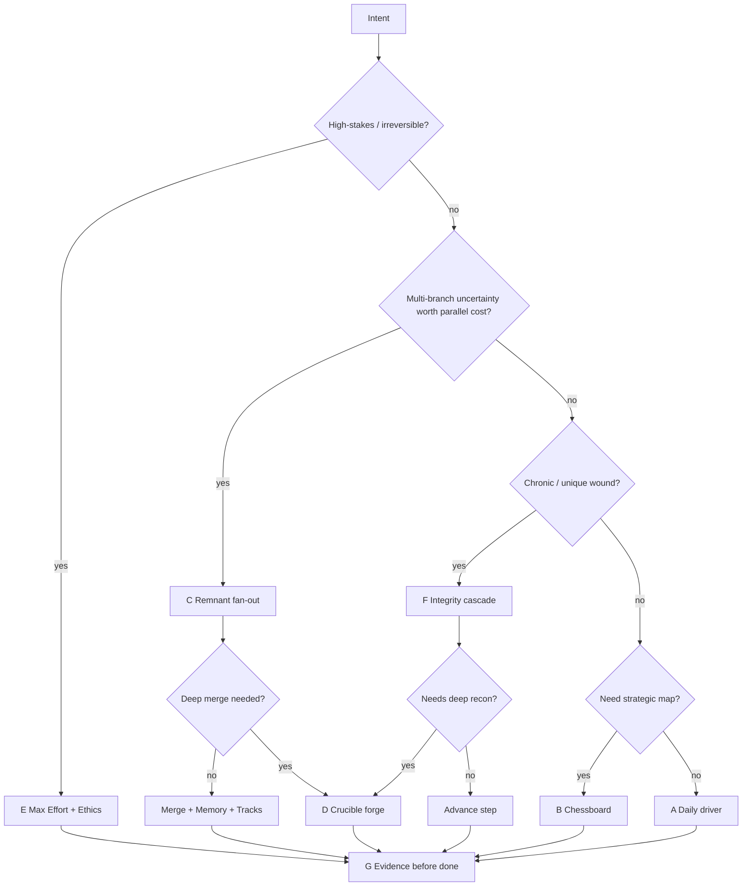
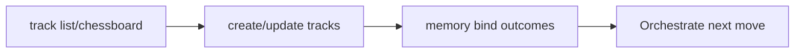
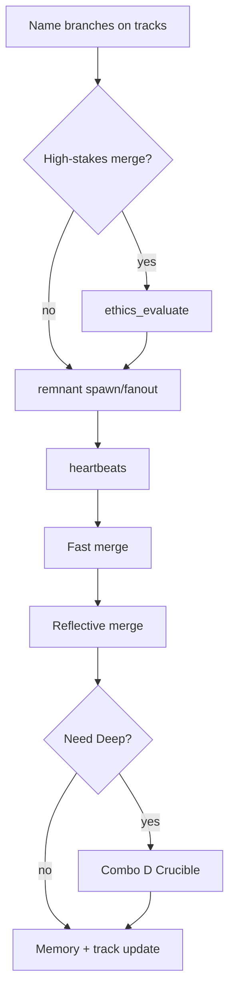
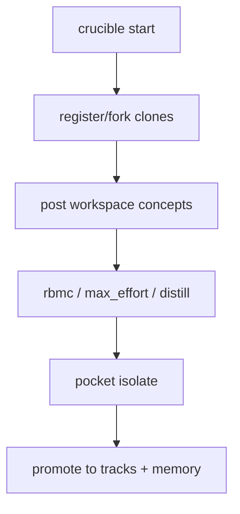
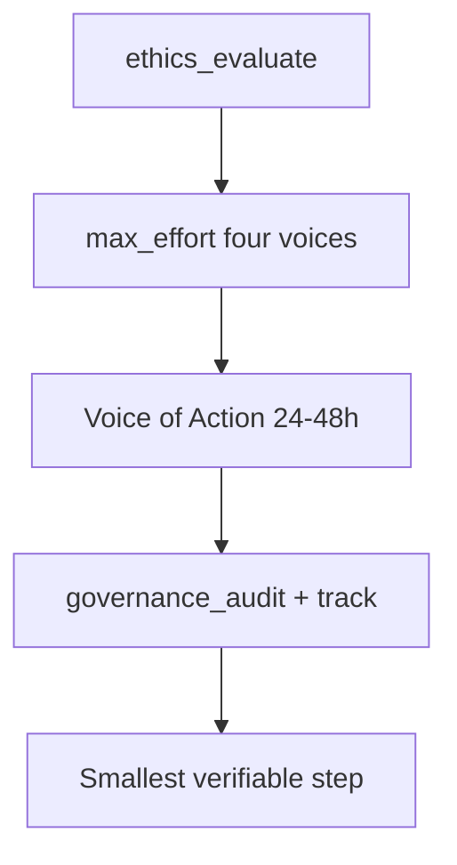
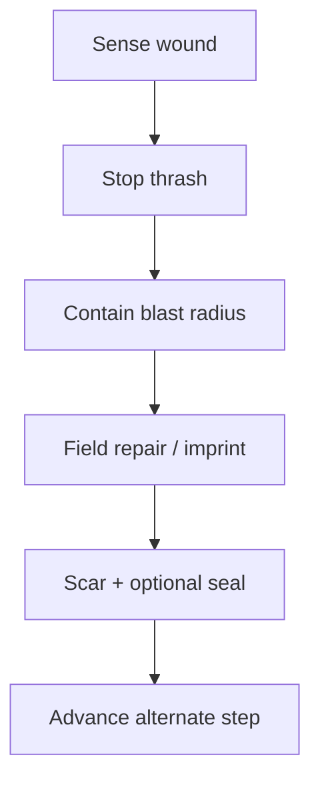
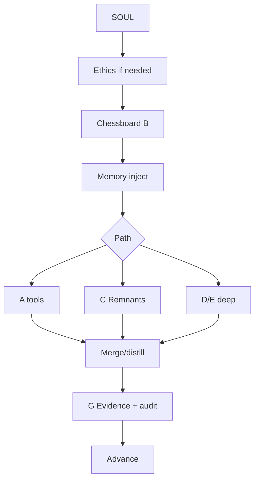

# Combo workflows

Operational flows for combos **A–H**. Catalog + decision tree: [PILLAR_COMBOS.md](PILLAR_COMBOS.md).  
Runtime: `conductor.combos` · skill `/combo` · slash `/combo` · tool `combo_route`.

---

## Decision tree

---

## A — Daily driver

1. Load SOUL + skills index  
2. Work under path-safety / thrash guard  
3. Optional episodic write  
4. Done only with proof  

**Tools:** host loop · `conductor_status` · `memory_episodic`  
**Skills:** `plan`, `review`

---

## B — Chessboard

1. `track_orchestrate` chessboard/list  
2. Create/update risks & opportunities  
3. `memory_episodic` bind  
4. Act from priority  

**Tools:** `track_orchestrate`, `memory_episodic`  
**Skills:** `plan`

---

## C — Parallel push (Remnant)

1. Light Combo B — name branches  
2. Ethics if merge is heavy  
3. `remnant_orchestrate` spawn/fanout  
4. Heartbeats  
5. Merge Fast → Reflective → Deep  
6. Memory + track artifact  

**Tools:** `remnant_orchestrate`, `track_orchestrate`  
**Skills:** `remnant-guide`, `plan`

---

## D — Deep forge (Crucible)

1. `crucible_workspace start`  
2. Clones + birth moments  
3. Post Global Workspace concepts  
4. RBMC / max_effort / distill  
5. Isolate; promote insights  
6. Audit + memory  

**Tools:** `crucible_workspace`, `track_orchestrate`  
**Skills:** `plan`, `remnant-guide`

---

## E — Max Effort decision

1. Ethics 7-point  
2. Four voices in Crucible  
3. Owner + deadline + criteria  
4. Audit + track  
5. Execute + evidence  

**Tools:** `ethics_evaluate`, `crucible_workspace`, `governance_audit`  
**Skills:** `review`, `plan`

---

## F — Integrity cascade

1. Sense — do not re-run same failure  
2. Contain (spine floors)  
3. Repair from imprint  
4. Scar / seal  
5. Promote seal only after gate  
6. Advance  

**Tools:** `memory_episodic`, `conductor_status`  
**Skills:** `review`

---

## G — Evidence gate

1. Plan with verification surfaces  
2. Execute under the right combo  
3. Review for gaps / drift  
4. Collect proof  
5. Claim done only if proven  

**Skills:** `plan`, `review`  
**Always fold into shipping paths.**

---

## H — Full stack

Rare high-leverage day. Prefer naming the real primary (C/D/E) and using H only when all layers fire.

---

## Runtime wiring

| Surface | How |
|---------|-----|
| Skill `/combo` | Recommend + workflow text |
| Slash `/combo` | `list` · `recommend <text>` · `workflow <id>` · `<id>` |
| Tool `combo_route` | Same actions for host agent loops |
| Skills plan / review / remnant-guide | Reference combos in output structure |
| Module | `from conductor.combos import recommend_combo, format_workflow` |
